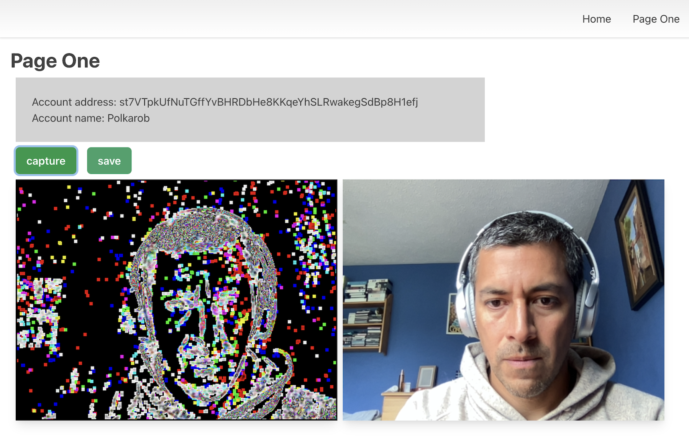

## Getting Started
- This is a [Next.js](https://nextjs.org/) project bootstrapped with [`create-next-app`](https://github.com/vercel/next.js/tree/canary/packages/create-next-app).
- The app uses cypress for testing and chakra-ui for styling.
- It uses a wasm file to process the images captured 
- It has been only been tested in chrome with the polkadot extension installed while running the suspace farmer and node locally.



First, install all the dependencies:

```bash
npm install
# or
yarn
```

Then run the development server:

```bash
npm run dev
# or
yarn dev
```

Open [http://localhost:3000](http://localhost:3000) with your browser to see the result.

## Testing
1. Run `yarn build`
2. Run `yarn e2e` and follow the instructions on the broweser (choose either E2E or Component testing)
3. Choose `Chrome` for browser and start testing
4. Click on the Component or E2E specs

